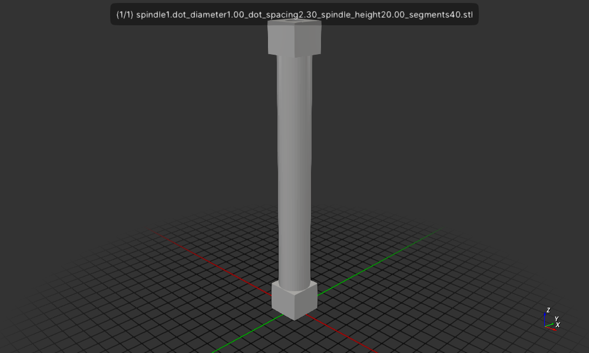

# bd-spindle 1

Create a braille spindle with a hollow center using `csgrs` a for a prototype of
a Braille Dot to on a Braille Display.

## Install

```
cargo install --path .
```
## Usage

```
$ bd-spindle1 
Usage: bd-spindle dot_diameter dot_spacing spindle_height segments 
```

## Run

Create a spindle with 1mm diameter dots, 2.3mm spacing, 20mm height, and 40 segments.
```
$ bd-spindle1 1 2.3 20 40
```

Display the spindle in a 3D viewer.
```
$ f3d spindle1.dot_diameter1.00_dot_spacing2.30_spindle_height20.00_segments40.stl
```

Create a png image of the spindle.
```
$ f3d spindle1.dot_diameter1.00_dot_spacing2.30_spindle_height20.00_segments40.stl --output spindle1.dot_diameter1.00_dot_spacing2.30_spindle_height20.00_segments40.stl.png
```



## License

Licensed under either of

- Apache License, Version 2.0 ([LICENSE-APACHE](LICENSE-APACHE) or http://apache.org/licenses/LICENSE-2.0)
- MIT license ([LICENSE-MIT](LICENSE-MIT) or http://opensource.org/licenses/MIT)

## Contribution

Unless you explicitly state otherwise, any contribution intentionally submitted
for inclusion in the work by you, as defined in the Apache-2.0 license, shall
be dual licensed as above, without any additional terms or conditions.
