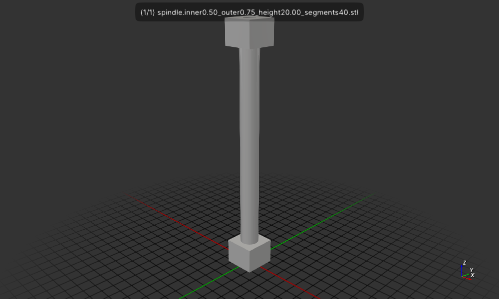

# Cad Experiment csgrs spindle 1

Create a spindle hollow center using `csgrs` a for a prototype of
a Braille Dot to on a Braille Display.

```rust
use std::env;

fn main() {
    // Alias the library’s generic CSG type with empty metadata:
    type CSG = csgrs::csg::CSG<()>;

    let args: Vec<String> = env::args().collect();
    let inner_radius = args[1].parse::<f64>().unwrap();
    let outer_radius = args[2].parse::<f64>().unwrap();
    let height = args[3].parse::<f64>().unwrap();
    let segments= args[4].parse::<usize>().unwrap();

    // Create two shapes:
    let inner_cylinder = CSG::cylinder(inner_radius, height, segments, None);  // 1 x 20 cylinder
    let outer_cylinder = CSG::cylinder(outer_radius, height, segments, None);  // 1 x 20 cylinder

    // Difference one from the other:
    let difference_result = outer_cylinder.difference(&inner_cylinder);

    // Write the result as an ASCII STL:
    let name = &format!("cylinder_inner{:0.2}_outer{:0.2}_height{:0.2}_segments{:0.2}", inner_radius, outer_radius, height, segments);
    let stl = difference_result.to_stl_ascii(name);
    std::fs::write(name.to_owned() + ".stl", stl).unwrap();
}
```

## Usage

The Cargo.toml file has 3 ways to depend on `csgrs`:
  * Using no features it will use the crates.io version 0.15.2 of `csgrs`
  * using --features csgrs-local it will use a local version `csgrs`
  at `/home/wink/data/prgs/rust/forks/csgrs`
  * using --features csgrs-git it will use the git version
  from https://github.com/winksaville/csgrs.git, i.e. my repo
5 examples:

```
wink@3900x 25-02-24T23:15:44.488Z:~/data/prgs/rust/myrepos/braille/cadx-csgrs-spindle1 (main)
$ cargo run -- 0.5 0.75 20 40
    Finished `dev` profile [unoptimized + debuginfo] target(s) in 0.06s
     Running `target/debug/cadx-csgrs-1 0.5 0.75 20 40`
wink@3900x 25-02-24T23:16:13.239Z:~/data/prgs/rust/myrepos/braille/cadx-csgrs-spindle1 (main)
$ f3d spindle.inner0.50_outer0.75_height20.00_segments40.stl --output spindle.inner0.50_outer0.75_height20.00_segments40.stl.png
wink@3900x 25-02-24T23:16:24.928Z:~/data/prgs/rust/myrepos/braille/cadx-csgrs-spindle1 (main)
```



## License

Licensed under either of

- Apache License, Version 2.0 ([LICENSE-APACHE](LICENSE-APACHE) or http://apache.org/licenses/LICENSE-2.0)
- MIT license ([LICENSE-MIT](LICENSE-MIT) or http://opensource.org/licenses/MIT)

## Contribution

Unless you explicitly state otherwise, any contribution intentionally submitted
for inclusion in the work by you, as defined in the Apache-2.0 license, shall
be dual licensed as above, without any additional terms or conditions.
